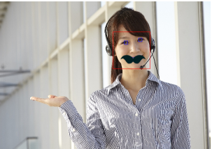
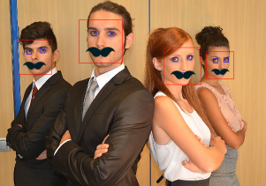
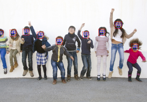

# FacialRecognition

This is iOS Facial Recognition Sample Project in Swift Language.

## Usage

## ToDo's

- Use images from device's album.
- Use images from device's camera
- Suggestions, issues and pull requests are more than welcome.

## Document
Qiita
http://qiita.com/oggata/items/8fc84124a256bfa505c0

## Contact

Fumitoshi Ogata
- carlsen.neve@engineer.com

## License
FacialRecognition is available under the MIT license. 
See the LICENSE file for more info.
